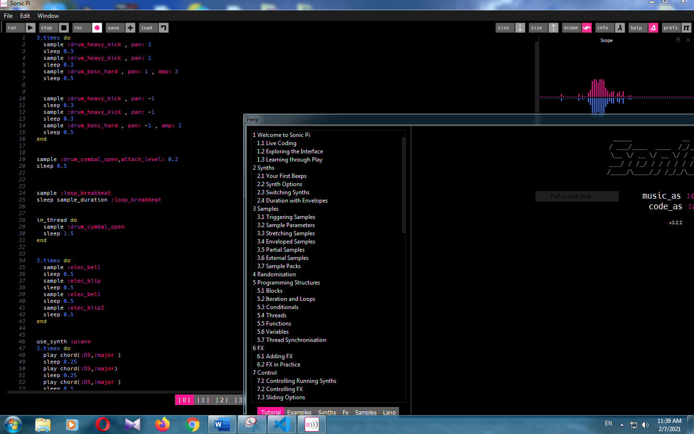

## پروژه موسیقی من

یکی از پروژه هایی که ما در ترم اول انجام دادیم موسیقی بود.پروژه موسیقی که ما در این ترم انجام دادیم  برای آشنایی با یک زبان برنامه نویسی جدید و مهم تر از همه برای علاقه مند تر شدن ما به مهندسی کامپیوتر بود. 
ما برای این کار از برنامه Sonic Pi استفاده کردیم که برنامه بسیار جالبی است و پیشنهاد میکنم حتما آن را دانلود و از آن استفاده کنید.
در مرحله اول با کمک های دکتر اعتمادی خانم خزایی کلاسی راجع به مباحث ابتدایی موسیقی به ویژه پیانو برایمان گذاشت.
در مرحله بعد با هماهنگی های استاد اعتمادی آقای عمویی کلاس پیشرفته تری به خصوص راجع به کار با Sonic Pi برایمان گذاشت.
بعد از آن من قسمت tutorial در بخش help برنامه را مطالعه کردم که واقعا خیلی خوب بود و توصیه میکنم حتما اگر خواستید کار کنید با این برنامه اول به این بخش مراجعه بنمایید.
پس از آن با ایده هایی که از بخش tutorial و آهنگ we will rock you از queen داشتم به سراغ کد زدن رفتم.
یک سری ایده هم داشتم که نصف اونا عملی شد ولی تقریبا نصفشون به کار نیمد.
بعد از آن با جمع بندی آن ها و منظم و مرتب کردنشان به یک چیز تقریبا خوب رسیدم.
لیکن کامل نبود. پس تصمیم گرفتم از یکی از دوستام کمک بگیرم.اونم کسی نیست جز سید مهدی حسینی زاده که خیلی دوست فوق العاده ای است.
پس من بعدش با استفاده از برناه Microsooft Teams با مهدی تماس گرفتم و صفحه ام رو شیر کردم و بعد از دو سه ساعت مشورت و کمک گرفتن و حذف و اضافه کردن یک سری کد ها به نتیجه نهایی رسیدم.
نتیجه نهایی یک آهنگ دو دقیقه ای شد که می توانید با کلیک روی لینک زیر یا روی عکس آن را بشنید.
و اینکه یک مسئله: یادتان باشد توقع شاهکار هنری مثل موتسارت یا بتهوون یا باخ از من نداشته باشید من هیچ پیشینه ای در زمینه موسیقی نداشتیم و هیچ گونه کلاسی هم نرفتم پس لطفا خیلی سخت نگیریرد و راضی باشید.

[link to my music on soundcloud](https://soundcloud.com/farzan-rahmani-74628015/my-project-music)

<audio controls>
    <source src="../assets/sonicpi/rahmani.wav" type="audio/wav">
</audio>

---