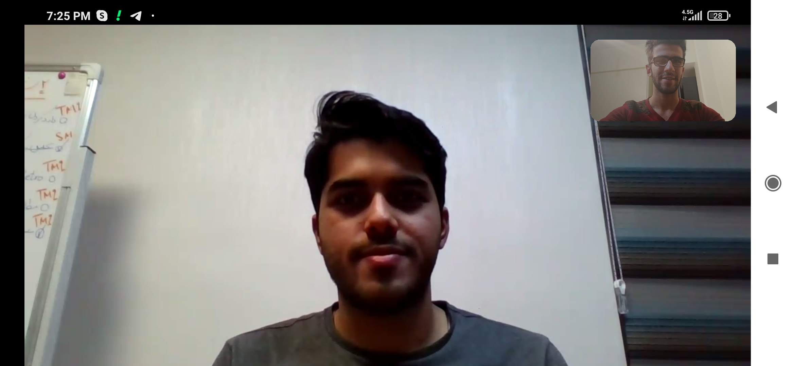

## My new friend and I in Skype
People in the picture are:
- Ali Alaei
- Me

This is an article about how to be success in computer engineering.I interviewd with a successful and fantastic friend in in this field.Ali Alaei,who i interviewed with,got me lost of his important experients.I asked lots of questions and Ali answered all of the them completely.  
I understood that the first language Ali leaened C++.He also told me that Dr.Ashtiani and Dr.Etemadi are two of the best professors at IUST.He also told me that all of the lessons that are specifically related to computer are mportant like Fondations of computer & programming,Advanced computer programming,Data structures,algorithm analysis and design and software engineering.
I asked him about going abroad or staying in Iran and he told me that it totally depends on your goals and you.If you want to design a OS or complicated programs Iran doesn't have its basics,but if want to make a start up or a simple program Iran has lost of opportunities.
Furthermore,he told me that your degree is important if you want to apply or become a professor at uni or do researches.However,if you want to work ,it isn't that important.
In addition,he told me that in his leisure time he sing and play musical instrument because he love art.he also added that sport is an essential part of his life.
Special thanks to Ali because of giving his precious time to Me and to Dr.Etemadi who has caused Me to get to know Ali.

--- 