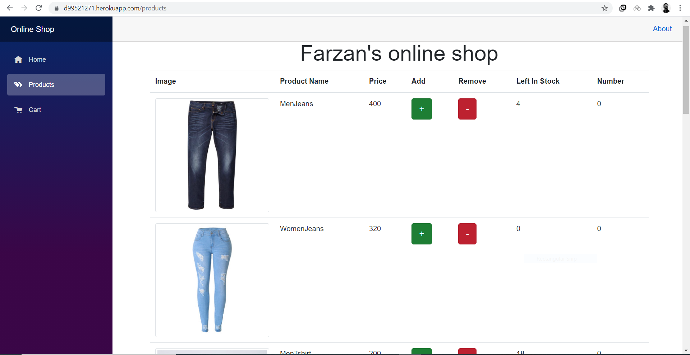

My 2nd term project in Advance Commputer Programing with Dr.Etemadi is this.
It was making a web app with dotnet blazor framework and I learned lots of new things.
One of the toughest and interesting among them was work with data base through api.

<!--  -->

[link to my website](https://d99521271.herokuapp.com/)

---